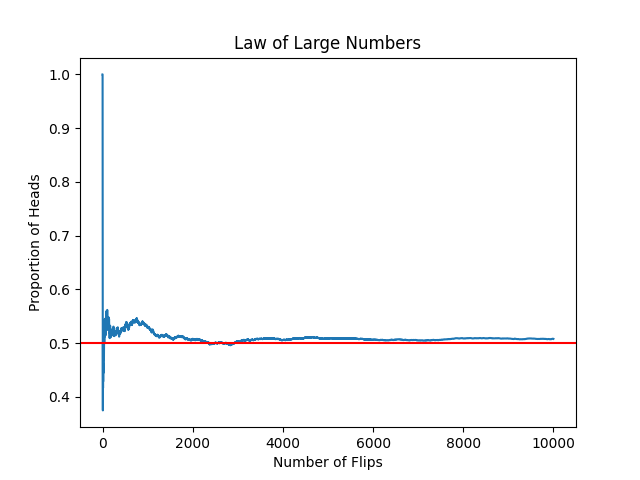

# Probability and Monte Carlo Simulations in Python

Author: Melika Ajir

## Overview

This repository contains Python simulations illustrating key concepts from probability theory and statistical inference.

The project was created as part of my independent study while preparing applications for doctoral research in mathematics, statistics and quantum information.

## Projects

### 1. Monte Carlo Estimation of Pi

Uses random sampling to estimate the value of π.

Concepts:
- Monte Carlo methods
- Random variables
- Statistical estimation

### 2. Coin Flip Simulation

Demonstrates the Law of Large Numbers using repeated coin tosses.

Concepts:
- Probability
- Convergence
- Statistical inference

## Skills Demonstrated

- Python
- NumPy
- Matplotlib
- Probability Theory
- Statistical Modelling
- Data Visualisation

## Future Work

- Central Limit Theorem simulations
- Bayesian inference examples
- Markov chains
- Statistical hypothesis testing
## Example Output

### Law of Large Numbers

